# 資訊安全期末報告

## Burp Suit實作

### Step.1
首先先確定JAVA有灌好

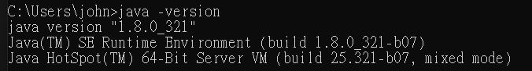

安裝、註冊與開啟(這時發現裝錯版本，卸載並重新下載安裝orz)
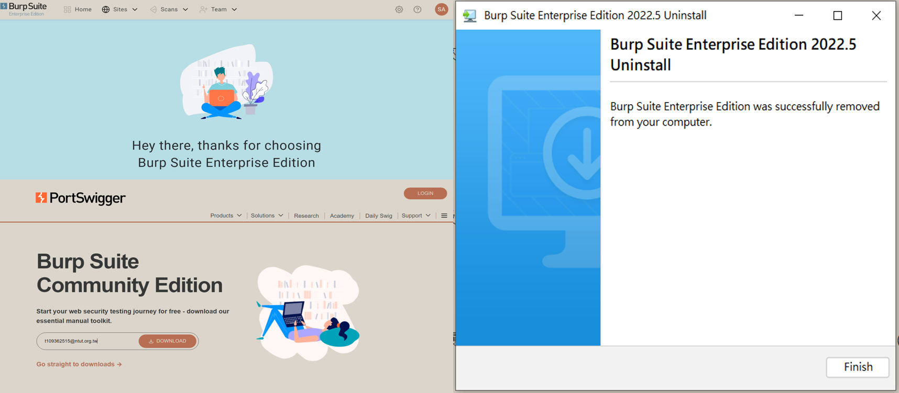

成功啟動好感動
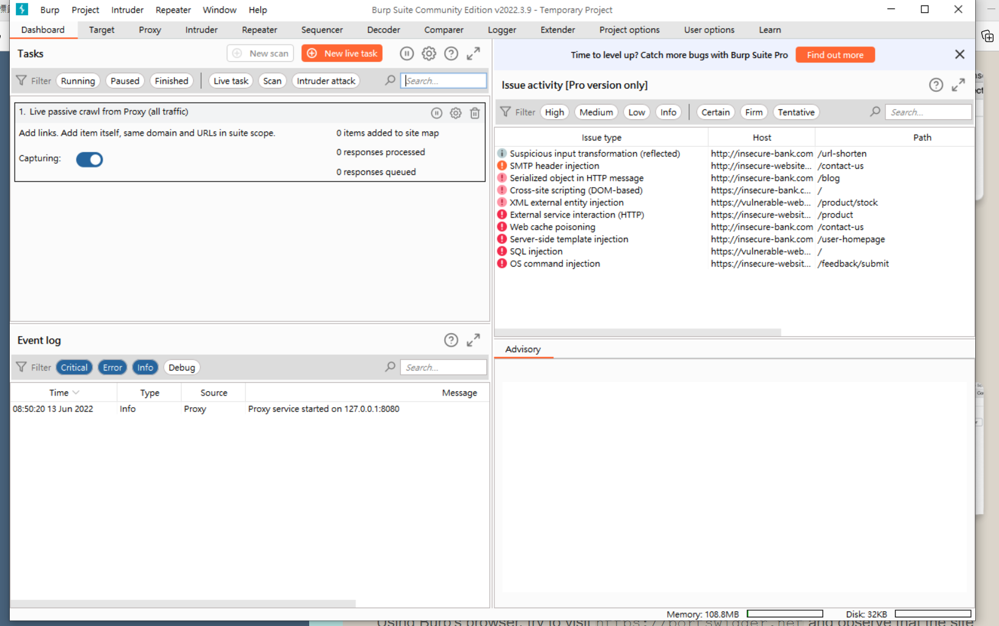

### Step.2
照著官方網站的教學操作(用Google翻譯)
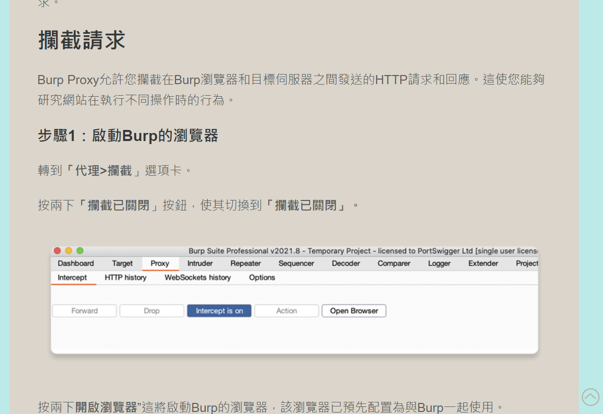
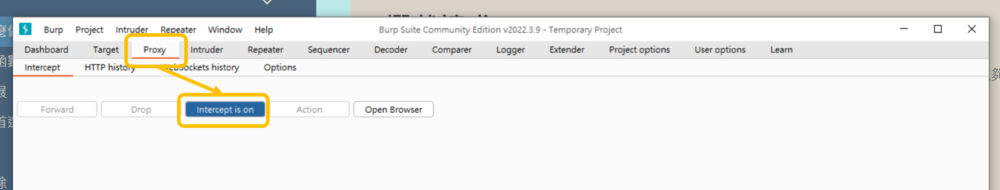

成功看到監聽的網站
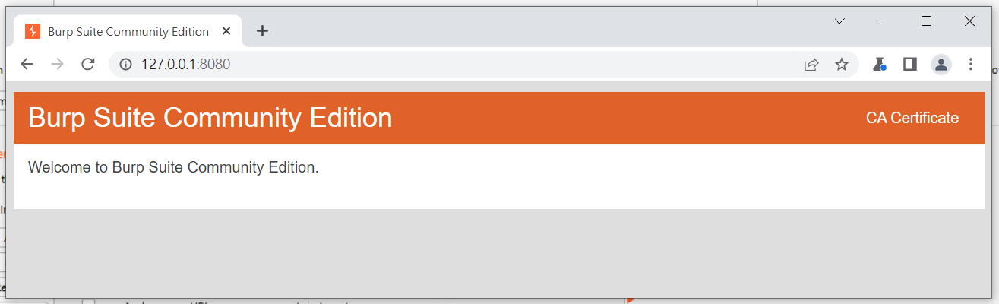

看一下自己的IPv4位址、設定參數
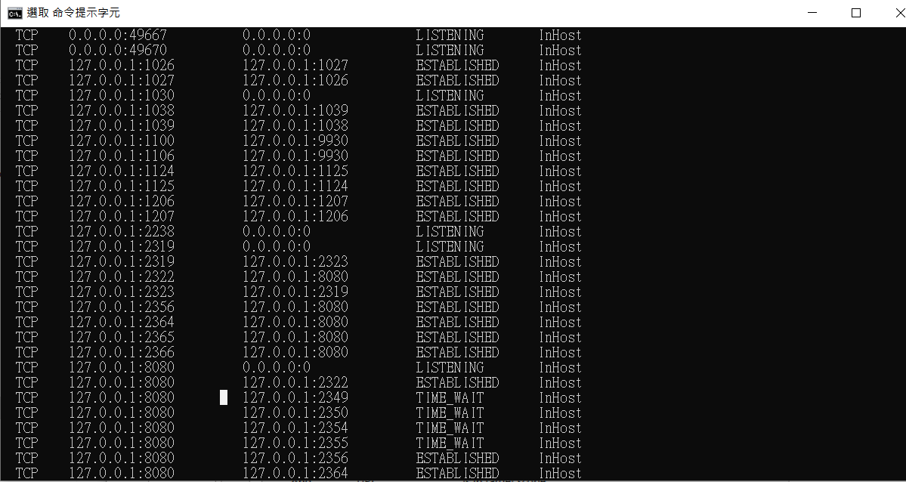
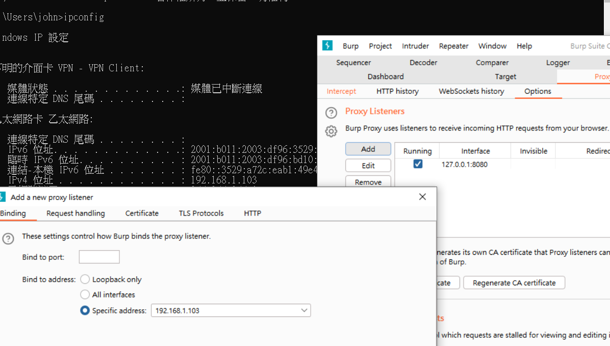

再試一次開啟，成功！(開心)
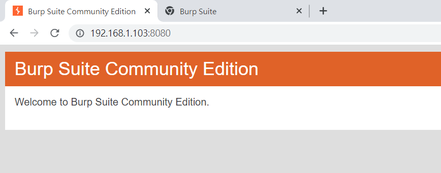

### Step.3
透過攔截修改網站購物車中的價格
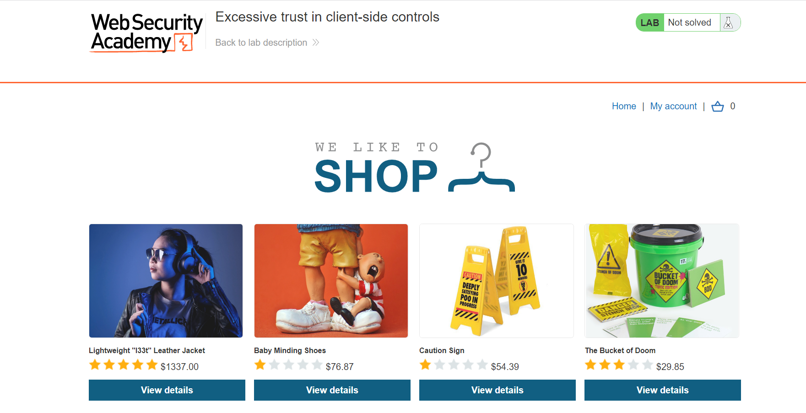
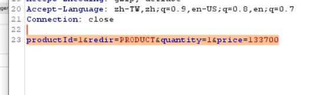
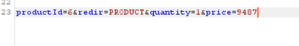

結果如下

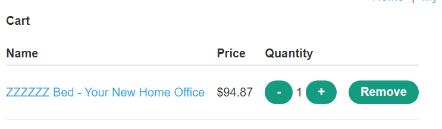

## 心得：
  老實說一開始碰到覺得都是英文好難好麻煩，幸好有認真的同學幫助才得以完成這些。很多東西是照著操作，背後的原理也還是在理解中，只知道了原來以前公司的資安課提到”http”和”https”有安全性上的差別，一直不太懂為什麼，通過這次的實作有了更深刻的了解。

  NFT也是通過了課程補足了相關知識，由淺入深，知道了原來大家在說的非同質化代幣到底是什麼，和電子錢包、虛擬貨幣等等之類的有什麼關聯、為何最近大家都在討論、怎麼這麼貴、價值何在？ERC是什麼？如何不被騙？老師在上課時也提及了許多~ (因為還是有些懵懵懂懂的地方所以看了這個影片稍微又懂了點：https://www.youtube.com/watch?v=6pBSpyDILqY)

  在搭加班車回家時總是想著：「哇… …這東西也太有意思了吧！如果能學會肯定很有趣~滲透測試什麼的聽起來好酷呀」，只可惜手邊沒電腦沒法跟著操作，回到家大多時候都已經下課了，碰上問題解決不了只能爬文，爬到12點多也沒辦法只好去睡了，畢竟明天還要上班QQ

  最後真的很感謝老師能夠分享這麼多知識給我們，誠心地感謝老師這學期的付出！
